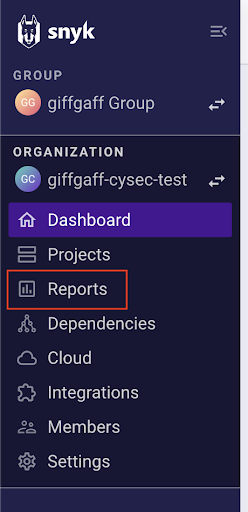
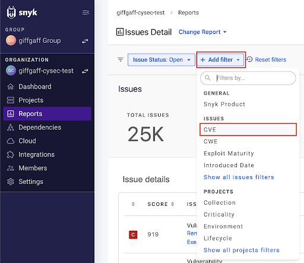
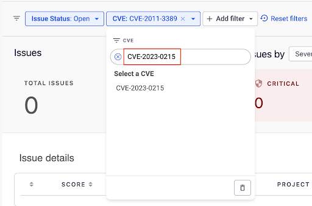
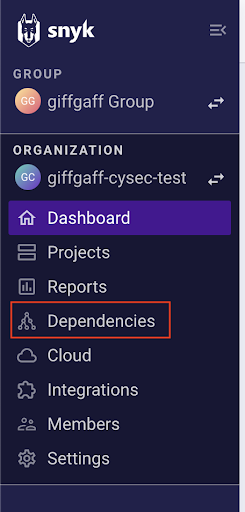
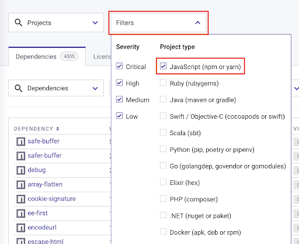
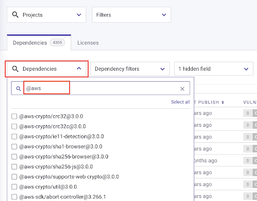
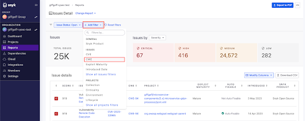
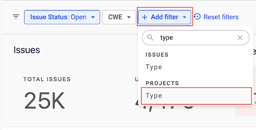
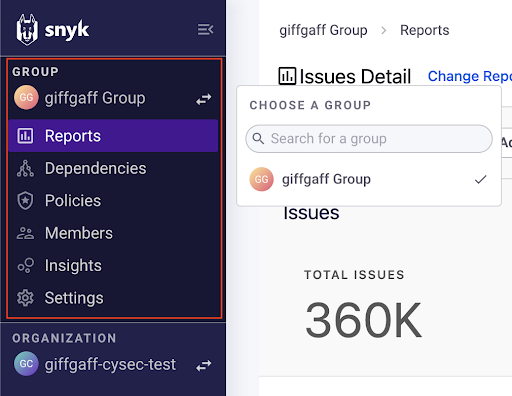
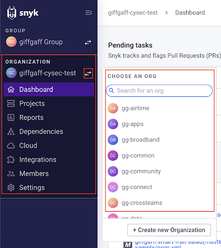

# Synk Security Guide

## Searching for Vulnerabilities 

Step 1: Go to the Reports page

Step 2: Click Add filter and select CVE from the dropdown menu

Step 3: Enter the CVE you want to search for as the filter optionde

## Searching for Malicious Packages

### Searching For Specific Packages 

Step 1: Go to the Dependencies page

Step 2: Filter for the type of package you want

Step: 3: Enter the specific package names in the search dropdown

### Searching For All Malicious 

Step 1: Go to the Reports page

Step 2: Click Add filter and select CWE from the dropdown menu

Step 3: Enter CWE-506 (CWE for malicious packages) as the filter option

Step 4: Add a new filter of Type (projects) and the malicious package type you are searching for (i.e. Javascript (npm or yarn)) 

## Searching Across All Organizations

- To search across all organisations use the Groups menu and select giffgaff Group.
- Use the Reports and Dependencies pages here to search for vulnerabilities and weaknesses across all organisations.

## Searching Across Individual Organizations

- To search individual organisations use the Organization menu and the Switch org button to find the organisation you want to search.
- Use the Reports and Dependencies pages here to search for vulnerabilities and weaknesses for a specific organisation

